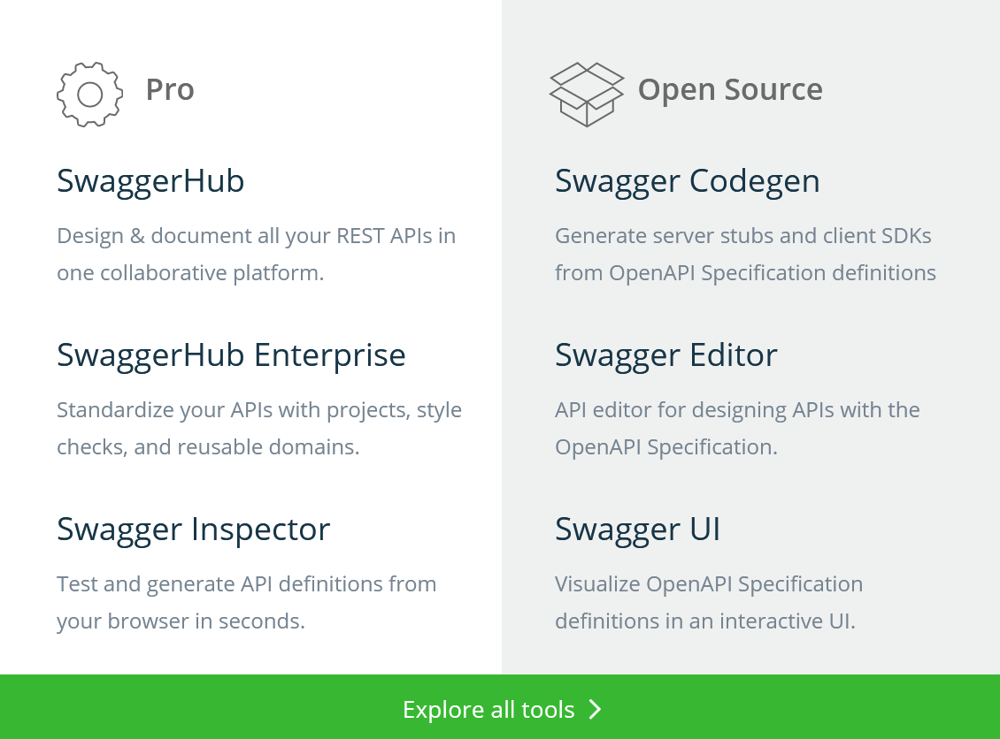

# Swagger

*  🔖 **Swagger**

___

## 📑 Swagger

La normalisation d'une API permet d'automatiser sa documentation et de favoriser le travail collaboratif.

La specification OpenApi créee par swagger utilise le design first. Avant de aprtir en logique métier, je vous conseil d'utiliser les Swagger `ui`, `editor` et `code gen` pour designer votre API. Ou plus simplement `SwaggerHub`.

https://app.swaggerhub.com/help/tutorials/getting-started

___

👨🏻‍💻 Manipulation

Désignez votre première api en utilisant un template blank et un protocol simple.

___
